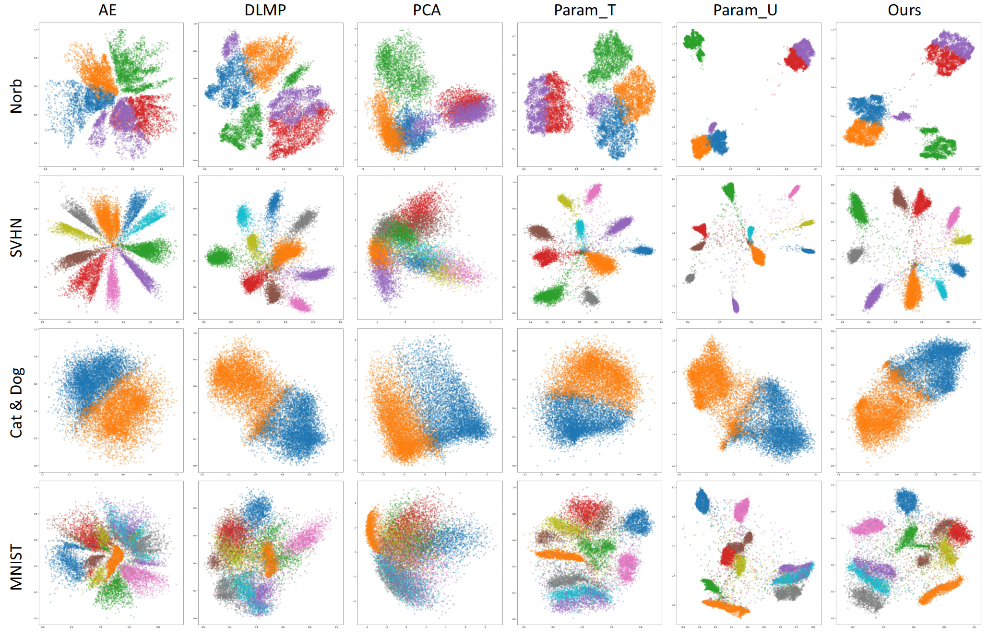

# Parametric-DR
Parametric Dimension Reduction by Preserving Local Structure



> **Abstract:** *We extend a well-known dimension reduction method, t-distributed
stochastic neighbor embedding (t-SNE), from non-parametric to
parametric by training neural networks. The main advantage of a
parametric technique is the generalization of handling new data,
which is beneficial for streaming data visualization. While previous
parametric methods either require a network pre-training by
the restricted Boltzmann machine or intermediate results obtained
from the traditional non-parametric t-SNE, we found that recent
network training skills can enable a direct optimization for the t-
SNE objective function. Accordingly, our method achieves high
embedding quality while enjoying generalization. Due to minibatch
network training, our parametric dimension reduction method
is highly efficient. For evaluation, we compared our method to
several baselines on a variety of datasets. Experiment results demonstrate
the feasibility of our method.*

## Paper
Download Paper from  <a href="https://github.com/a07458666/parametric_dr/blob/main/document/Parametric_t_SNE_main.pdf">Parametric Dimension Reduction by Preserving Local Structure</a>.


## Prerequisites
* pytorch (https://pytorch.org/)
* opentsne (https://opentsne.readthedocs.io/en/latest/api/index.html)
* umap (https://github.com/lmcinnes/umap)

## <div align="left">Quick Start Examples</div>

<details open>
<summary>Install</summary>
Clone repo and install requirements.txt in a Python>=3.7.0 environment, including PyTorch>=1.7.

```
git clone https://github.com/a07458666/parametric_dr  # clone
cd parametric_dr
pip install -r requirements.txt  # install
```
</details>

<details open>
<summary>Inference</summary>
You can try it in <a href="https://github.com/a07458666/parametric_dr/blob/main/tutorial.ipynb">jupyter note</a>

### TSNE_NN
```python
import numpy as np
import torch
from parametric_dr.tsne_nn import TSNE_NN
device = torch.device('cuda' if torch.cuda.is_available() else 'cpu')
epochs = 100
batch_size = 256

X = np.random.rand(512, 128)
X_embedded = TSNE_NN(device, n_epochs=epochs, batch_size=batch_size).fit(X)
```
</details>
